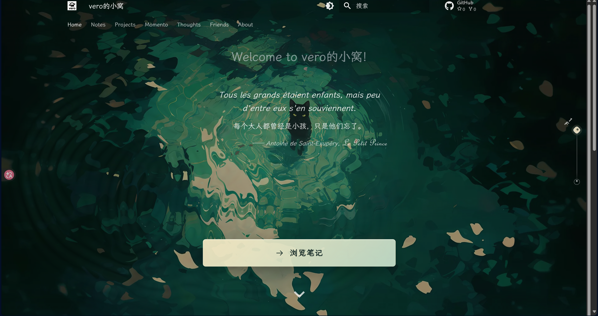
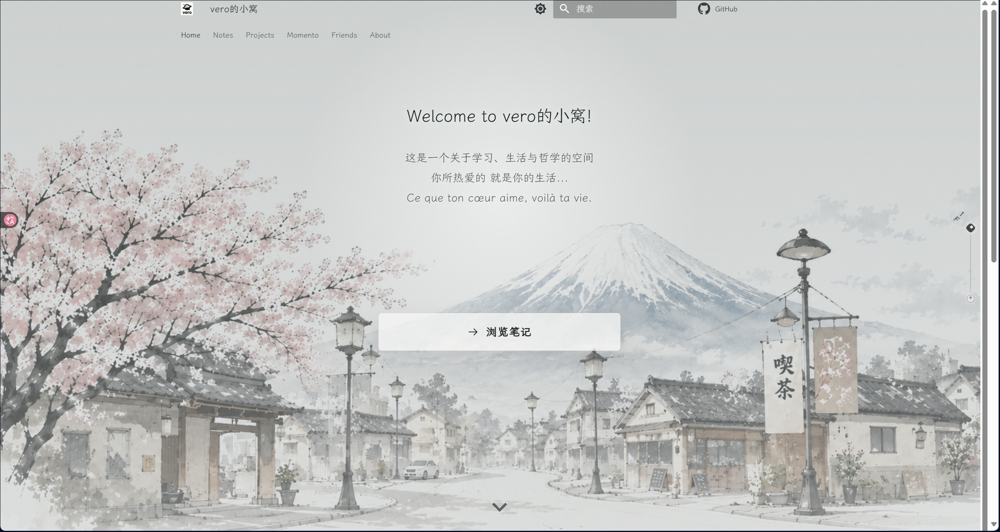
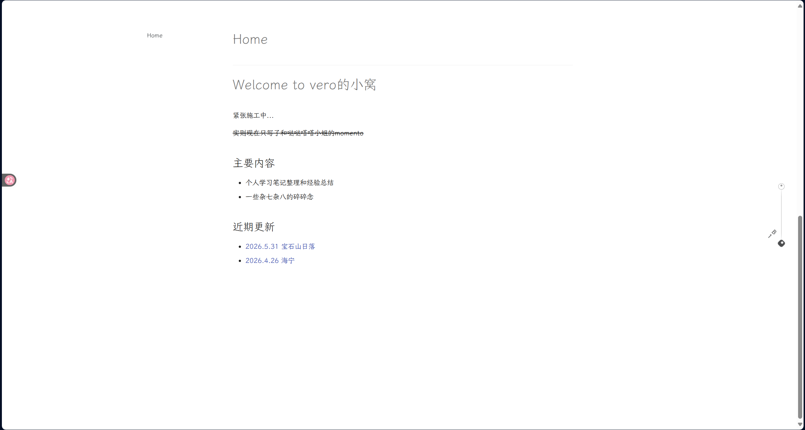
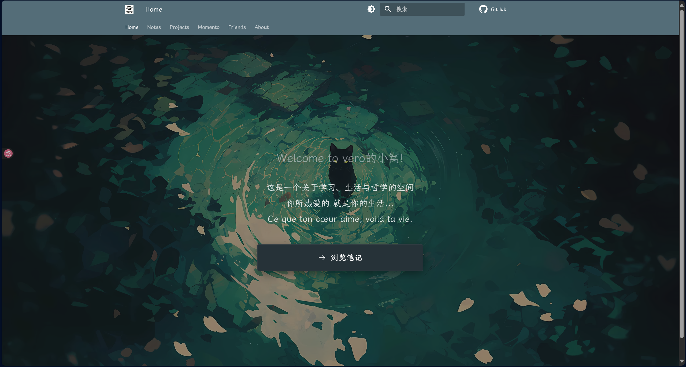
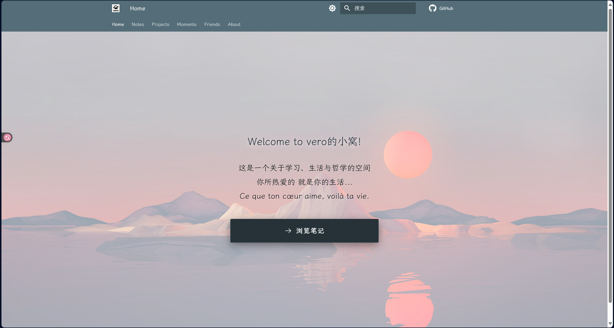
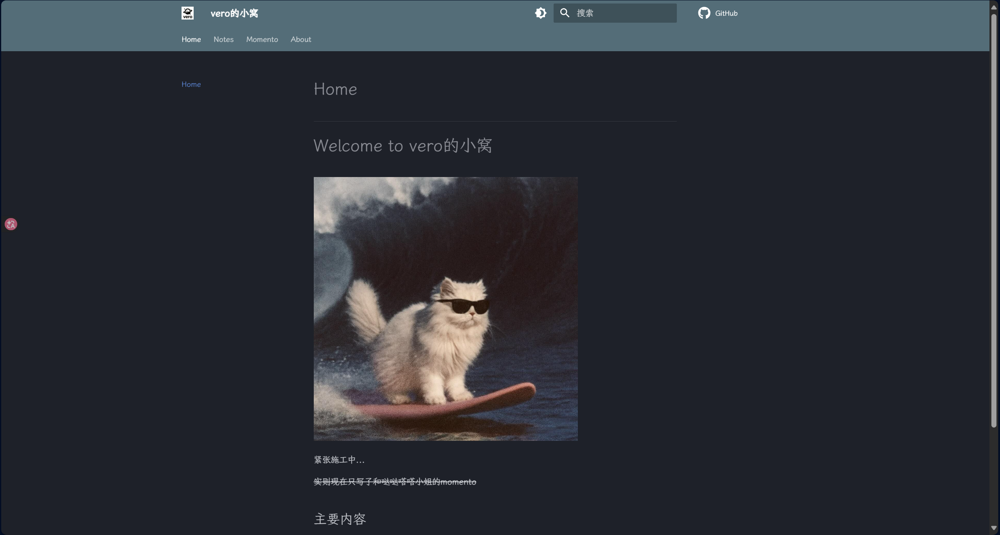

# 小窝的施工记录

持续更新中...

*陆陆续续开发小窝也有好几个月了，觉得非常有必要开一个版面记录小窝一路走来的点点滴滴，遂写施工记录~*

很古早的版本当时都没有截图保存，是后来用git还原历史版本后重新构建的

  <section class="site-history__entry">
    

    <header class="site-history__header">
      <time datetime="2026-06-14">2026.06.14</time>
      <h2>v3.0 · 动态壁纸</h2>
    </header>
    

      
首页搓了两个比较满意的动态动画

      
注意白昼模式樱花树和樱花花瓣是会动的！

    

    

      
    

  </section>

  <section class="site-history__entry">
    

    <header class="site-history__header">
      <time datetime="2026-06-09">2026.06.09</time>
      <h2>v2.0 · 首页重构</h2>
    </header>
    

      
首页用html加入了负一层（这一步用ds搞了好久没搞定，后来用codex一下就解决了...）

      
白昼模式的图片是用gpt生成的:）

    

    

      
      
    

  </section>

  <section class="site-history__entry">
    

    <header class="site-history__header">
      <time datetime="2026-04-24">2026.04.24</time>
      <h2>v1.1</h2>
    </header>
    

      
加入了两张静态图片作为首页的背景

    

    

      
      
    

  </section>

  <section class="site-history__entry">
    

    <header class="site-history__header">
      <time datetime="2026-04-20">2026.04.20</time>
      <h2>v1.0 · 小窝落成</h2>
    </header>
    

      
偶然看到MkDocs，果断尝试，效果惊艳...当时的首页还是用纯markdown手搓的（

    

    

      
    

  </section>

<dialog class="history-lightbox" data-history-lightbox aria-label="图片预览">
  <button class="history-lightbox__close" type="button" data-history-lightbox-close aria-label="关闭图片预览">×</button>
  
</dialog>

其实最开始的开始有一个用Jekyll搭建的版本，不过由于上手比较困难，遂果断转战MkDocs了:nerd:
